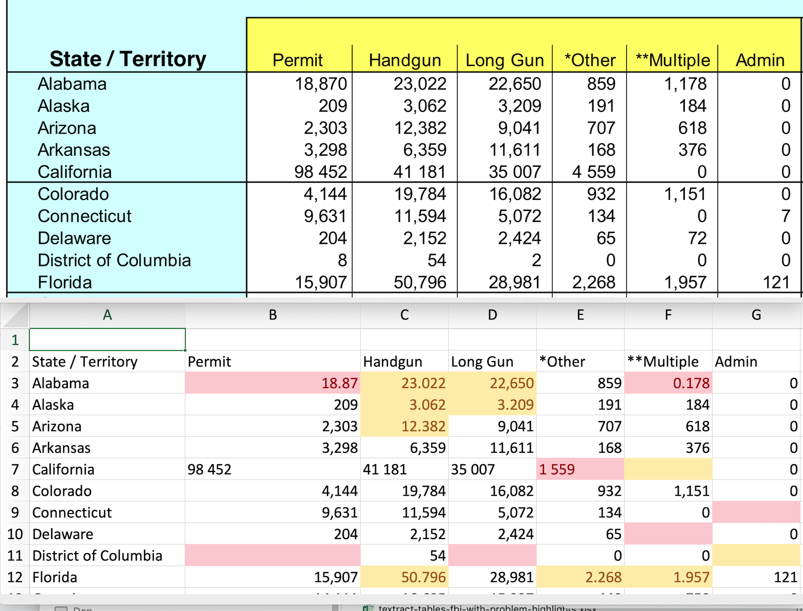
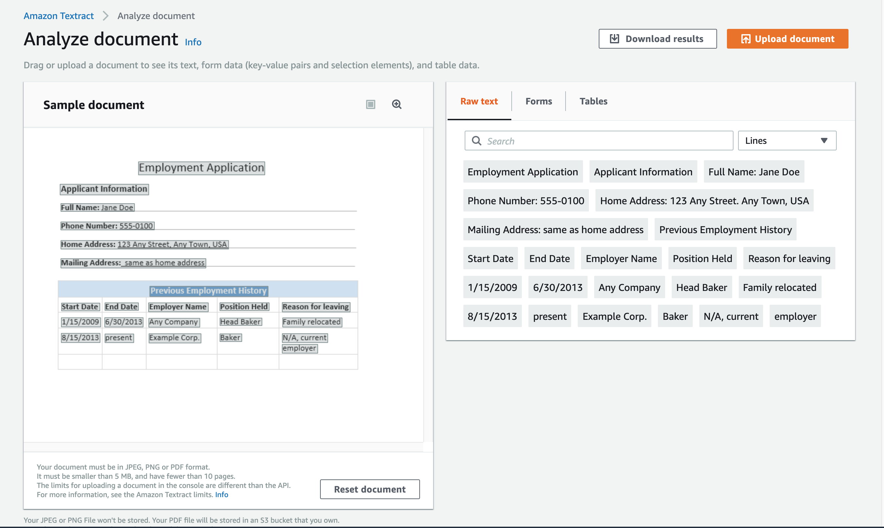
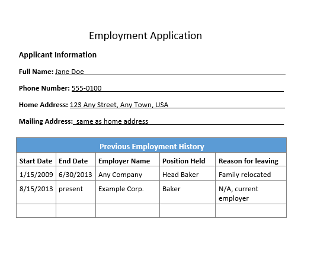
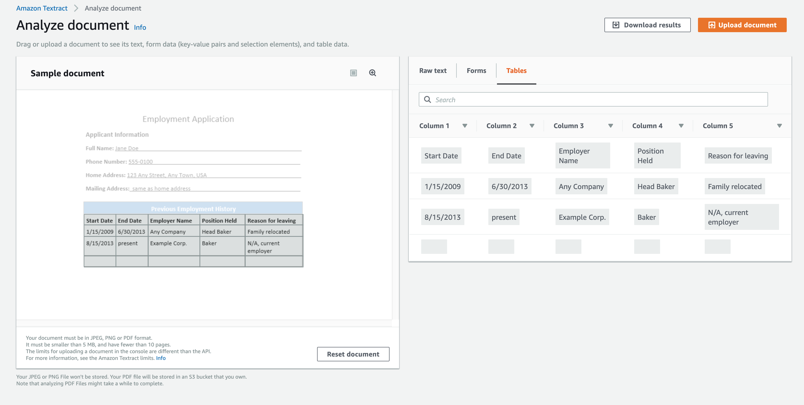
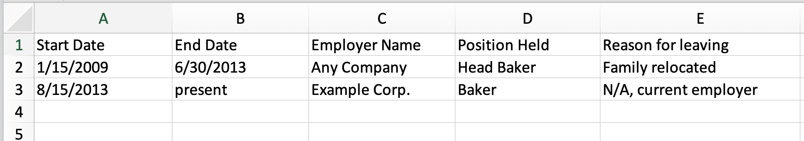

# How good is AWS Textract at extracting data tables from PDFs, and can it deliver us from the eternal fiery suffering that is converting-pdf-to-csv today

Amazon has just released its long-awaited [Textract cloud service](https://aws.amazon.com/textract/) for public use. Textract claims to perform the miracle of efficient and accurate extraction of text (i.e. optical-character recognition) and tabular data, from every and all the cursed PDFs and scanned documents we upload to its cloud algorithms.

This repo aims to show how Textract performs on real-world PDFs, and how it compares to the current and messy state-of-the-art and expectations. 

### (work in progress)

You can jump down to where [I go through Textract's canned-demo, and provide Textract's raw data and some observations](#bookmark-textract-demo) about Textract's functionality. (tl;dr: surprise surprise, Textract performs perfectly in a staged demo)

For a real-world complicated example, you can check out the raw data results and a [partial writeup](./examples/fbi-nics/README-fbi-nics.md) on how Textract handles a sample report from the FBI National Instant Criminal Background Check System. The writeup [contains some background about this particular report (and how I got the inspiration from BuzzFeed News's Jeremy Singer-Vine)](./examples/fbi-nics/README-fbi-nics.md) as well as my initial observations and disappointments.

tl;dr: Textract did a good job with the hard problem of extracting tabular structure. But it inexplicably screws up the easier problem of not adding random errors to the data. It does seem to be fixable, but currently Textract won't be an automatically replacement for ABBYY FineReader, or libraries like Tabula and Camelot:

----------------

> **NOTE: This repo is a work in progress** (and likely to be abandoned because I hate pdf work when it's for an actual job, and despite it even more as a hobby). I originally wanted to do a quick writeup of the new AWS Textract cloud service, and I thought I could write about how it did on a particular FBI data report [in just a single Github gist](https://gist.github.com/dannguyen/3673e67a495c172abbd3bb8a9a6e199a). But I soon realized the number of files involved – e.g. screenshots, example PDFs, CSV output from multiple software solutions besides Textract – was really impractical for a Github gist, and much more manageable as a Github repo. So here you are.

## Intro to AWS Textract, i.e. why Textract and who cares?

**Amazon Textract** was [announced about 6 months ago](https://news.ycombinator.com/item?id=18554122) but was made [public today (May 29)](https://finance.yahoo.com/news/aws-announces-general-availability-amazon-220000840.html). If have an AWS account, you can check out Textract's point-and-click demo, which allows you to upload an image or PDF for Textract to process with optical character recognition (OCR) and data table extraction. Obviously, the OCR ability is going to be a huge feature for many folks dealing with trying to extract data from scanned documents. However, Textract's capabilities in **data table extraction** is the focus of this gist)

OCR (extracting text from images, i.e. scanned documents) is already a high-demand digital service, with popular solutions such as [Google Cloud Vision's Detect Text API](https://cloud.google.com/vision/docs/ocr) and the [open source Tesseract library](https://github.com/tesseract-ocr/tesseract), which services like [DocumentCloud use to make scanned PDFs searchable as text](https://www.documentcloud.org/documents/5955118-The-Mueller-Report.html).

Extracting tabular data from PDFs (even document PDFs with plaintext data that don't require OCR) is geekier and lesser-appreciated problem, but unfortunately, one that is still critical for much investigative data journalism (and data work in general). I've [compiled a separate section about this horrible niche problem](#bookmark-pdfs-hard). But it's enough to say that Textract is an exciting announcement because Amazon has a proven reputation for making powerful and easy-to-use cloud APIs.

### The easy Textract demo

Like most of their cloud APIs, Amazon provides an easy-to-use point-and-click demo of Textract in the AWS console: 

https://console.aws.amazon.com/textract/home#/demo

The Textract demo allows us to upload our own image or PDF to process. As you can see in the left panel, the demo comes [conveniently preloaded with an example file](https://s3.us-east-1.amazonaws.com/textract-public-assets-us-east-1/default_document.png) –  a sample "Employment Application" document that you might create in a word processor, which includes a simple data table titled, **"Previous Employment History"**. The right half of the demo page displays the purported results of Textract's analysis – specifically, the extracted "Raw Text".

So whether the example sample document is an image or a PDF document is an important technical detail. It seems to be this [PNG file served from Amazon's servers](https://s3.us-east-1.amazonaws.com/textract-public-assets-us-east-1/default_document.png). However, I've saved a copy of the PNG to this repo and embedded it here so you can see it in closer detail:

    

I also uploaded my copy of the PNG to the Textract demo, just to make sure the analyzed results aren't a canned file. 

Why is it important that the analyzed sample file is a PNG image file rather than a document PDF? Because the latter would not require OCR processing, since the PDF document contains the actual text content/layout. I can't find the original document for Textract's sample document (i.e. in PDF format) so we don't have any choice but to see how good Textract is at in both its OCR feature and its tabular data extraction feature.

(again, most data folks would be extremely happy for Textract to succeed in just the latter feature)

### How Textract performs on its own sample document and data table

And...it's a miracle! Textract appears to succeed perfectly in the demo -- extracting text from the image file, and figuring out its likely tabular structure. First, here's a screenshot of the demo interface providing a preview of the tabular extraction:

And here's what the extracted tabular data (downloadable from the demo interface as [tables.csv](examples/default-sample-document/results/textract-results-default_document-zip/tables.csv)) looks like when opened in Excel:

## The data files created by the Textract API

OK, obviously, it shouldn't be a surprise that Amazon Textract perfectly passed a test designed by Amazon Textract engineers and product managers. Still, the demo is useful in showing quickly what Textract claims to do, and the data the provides in doing it.

TODO: More explanatory stuff and observations.

For your convenience, this repo contains the zip file that the Textract demo supplies as a download, and the individual data files extracted from that zip:

- [textract-results-default_document.zip](examples/default-sample-document/results/textract-results-default_document.zip): the zip file that the Textract demo serves as a download. In the zip file are 4 data files:
     - [apiResponse.json](examples/default-sample-document/results/textract-results-default_document-zip/apiResponse.json)
     - [keyValues.csv](examples/default-sample-document/results/textract-results-default_document-zip/keyValues.csv) (note: this file is empty)
     - [rawText.txt](examples/default-sample-document/results/textract-results-default_document-zip/rawText.txt)
     - [tables.csv](examples/default-sample-document/results/textract-results-default_document-zip/tables.csv)

If you want to see how Textract does with a real-world document, [you can see my partial writeup on the FBI NICS reports](./examples/fbi-nics/README-fbi-nics.md) (tl;dr: Textract currently does not do well enough to be our data-document-savior). Maybe later I'll upload the results of other real-world data PDFs.

### Other examples of real-world PDFs (TK)

(todo)

- California WARN notices (should be easy)
- Senate financial disclosures (as much of a clusterfuck as this problem can get; see [related repo using ABBYY FineReader](https://github.com/dannguyen/abbyy-finereader-ocr-senate))

## Background stuff

### Why extracting data tables from PDFs is so hard

PDF is a great format for when you need a digital document that – unlike the vast majority of webpages and spreadsheets – will essentially look the same to anyone else who opens it on any computer, and/or wants to print it out on paper. PDFs, like Word documents, can contain not just standard prose, but data tables – such as copy-pasting from an Excel spreadsheet into Word, and then saving as PDF.

But for various technical reasons, extracting the data table from a PDF is often not as easy as copy-pasting from PDF into Excel. In fact, the metadata of the data's layout and structure is usually destroyed and irrecoverable when data tables are saved as PDF documents. It's a hard enough problem that it's one of the only situations in which I've given up on trying to hack it myself and settled for a commercial software package that is non-unscriptable (i.e. have to use by manual point-and-click): $99 for ABBYY FineReader – [which is *still* far-from-perfect but good enough](https://github.com/helloworlddata/white-house-salaries), all things considered.

Note: If you are interested in more technical details about on why extracting data tables from PDFs is so complicated, I highly recommend the following resources:

- [Heart of Nerd Darkness: Why Updating Dollars for Docs Was So Difficult](https://www.propublica.org/nerds/heart-of-nerd-darkness-why-dollars-for-docs-was-so-difficult), by ProPublica's Jeremy Merrill, which is an excellent and detailed overview of the PDF problem and how it applies to a real-world data investigation.
- [Introducing Tabula](https://source.opennews.org/en-US/articles/introducing-tabula/), by the authors of the Knight Mozilla-supported [open source Tabula project](https://source.opennews.org/articles/introducing-tabula/), because PDF-to-CSV is really that huge of a data problem for journalists.
- [Introduction to The Camelot Project](https://camelot-py.readthedocs.io/en/master/user/intro.html), excellent documentation and writeup by another open source PDF-to-CSV extraction library and tool, because PDF-to-CSV is a massive problem for everyone who works with documents and data
- [One of the many, many Hacker News discussions about how awesome it would be if someone could create a good PDF-to-CSV tool](https://news.ycombinator.com/item?id=13729301)
