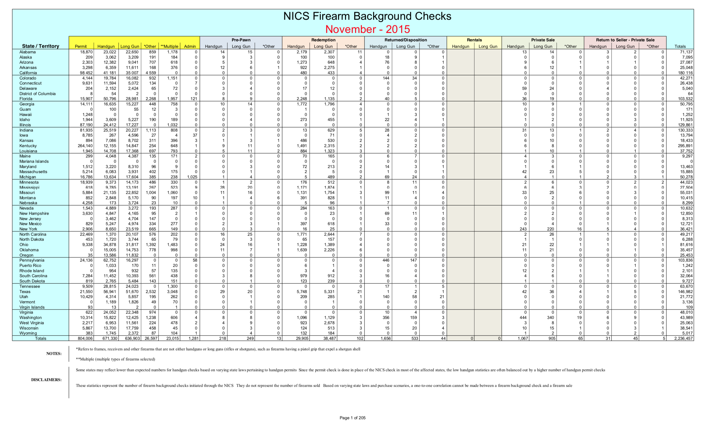
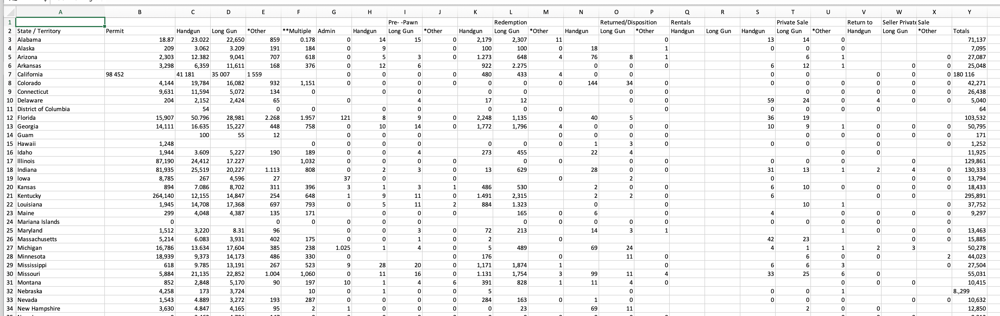
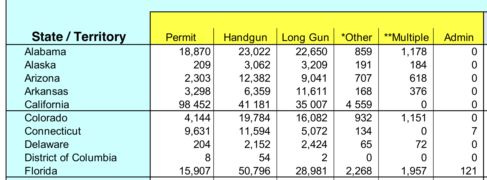
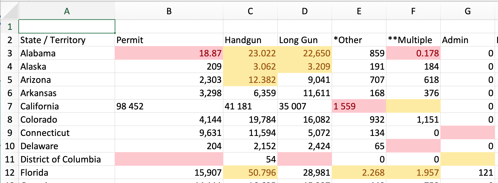
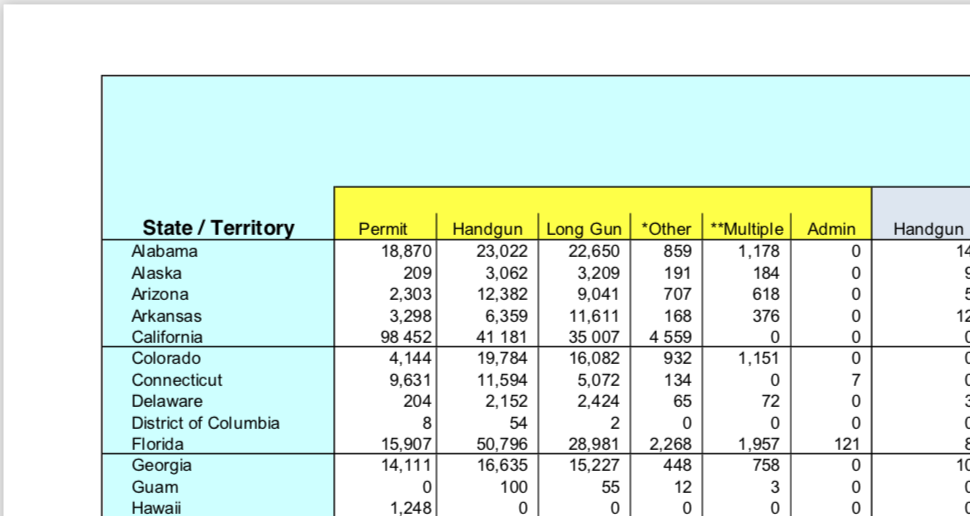

# Testing AWS Textract's ability to correctly extract data tables from a difficult FBI stats report PDF

(not done yet)

> tl;dr: pretty good table structure overall, given the issues with the original PDF. However, there were inexplicable and critical data errors, as if Textract converted the PDF to an image, OCRed it, and then attempted to extract the data tables.
> 

## Intro

For this example, I'm only interested in how good Textract is when it comes to extracting data tables from **non-image PDFs**. In other words, I don't really care right now about Textract's OCR's capability, [though if you do care, you can read Mozilla Source's roundup of OCR options (which didn't include Textract at time of publication)](https://source.opennews.org/articles/so-many-ocr-options/) to get a taste of how complex and painful the OCR problem is on its own. 

In other other words, we can assume that if data table extraction is hard, then data table extraction on the results of OCRed document is an additional level of of clusterfuck complexity; if Textract can just get data table extraction right, that's a huge victory for data folks.

## Why the FBI's report on background checks for firearms is a very annoying data PDF

When wanting to put Textract through a real PDF test, I immediately thought of the PDFs generated by the **FBI's National Instant Criminal Background Check System**, which Jeremy Singer-Vine uses as an example (complete [with Jupyter notebook](https://github.com/jsvine/pdfplumber/blob/master/examples/notebooks/extract-table-nics.ipynb)) to demonstrate the **pdfplumber** library he wrote (yes, yet another open source PDF-to-CSV project, because it really is such a painful and critical problem). 

The actual FBI NICS PDF contains hundreds of pages. For the purposes of this exercise, we just use its first page, which is a report for November 2015. This single-page PDF is stored on this repo as: [fbi-nics-sample-page.pdf](fbi-nics-sample-page.pdf). (Note: this sample PDF was copied directly from [jsvine/pdfplumber](https://github.com/jsvine/pdfplumber/blob/master/examples/pdfs/background-checks.pdf)'s example,[ background-checks.pdf](https://github.com/jsvine/pdfplumber/blob/master/examples/pdfs/background-checks.pdf))

Here's a screenshot of the PDF, which shows the scope of the data at a glance, but doesn't show the subtle, annoying design problems that can screw with pdf-to-csv algorithms:

(TODO: maybe list some of those specific technical problems)

You can read Singer-Vine's [helpful Python notebook showing the code and the PDF](https://github.com/jsvine/pdfplumber/blob/master/examples/notebooks/extract-table-nics.ipynb). Or better yet, you can read Singer-Vine's [separate writeup of the FBI data](https://github.com/BuzzFeedNews/nics-firearm-background-checks) (one of the best web-scraping-for-journalism examples I've seen). Or even even better, read a story that Singer-Vine's BuzzFeed News colleague, Peter Aldhous, wrote based on the data: [Under Trump, Gun Sales Did Not Spike After The Las Vegas Shooting](https://www.buzzfeednews.com/article/peteraldhous/gun-sales-after-vegas-shooting).

Suffice to say, the background-checks.pdf supplied by pdfplumber's examples is a very nice example of a data-stuck-in-PDF problem: it has real-world importance and is actually, at first glance, very readable, but contains enough technical and epistemological issues to be a hard challenge to both humans and automated software when it comes to extracting the data.

## How Textract handles the FBI NICS example PDF

So I uploaded the single-page example [backgrounds-checks.pdf](https://github.com/jsvine/pdfplumber/blob/master/examples/pdfs/background-checks.pdf) to Textract. After about a minute, I was able to download a zip which contained 4 files; I've uploaded the zip and the individual files to this repo:

- [textract-results-fbi-nics.zip](results/textract-results-fbi-nics.zip): the zip file that the Textract demo sends you as a download
     - [apiResponse.json](results/textract-results-fbi-nics-zip/apiResponse.json)
     - [keyValues.csv](results/textract-results-fbi-nics-zip/keyValues.csv) (note: this file is empty)
     - [rawText.txt](results/textract-results-fbi-nics-zip/rawText.txt)
     - [tables.csv](results/textract-results-fbi-nics-zip/tables.csv)

**tables.csv** is the thing we obviously care about. You can download it and open it in Excel yourself, but for your convenience, I've also uploaded it to Google Sheets (TODO). Or you can just read my quick summations and screenshots below:

Here's a screenshot of the top half of the table, and all of its columns, to show that Textract did quite well in not only getting the right number of columns, but also dealing with the confusing grouped headers

However, on closer inspection of the first few rows and columns, we can see that Textract made some serious errors in transcribing data values. Here's a closeup of those rows and columns in the PDF:

And here a closeup of the Textract tables.csv in Excel -- I've manually highlighted the problems; yellow for serious and red for really f--king serious:

> Note: I stupidly forgot to configure Excel to *not* do its dumbass default behavior of typecasting data, so the above screenshot does *not* contain the literal text of tables.csv. For example, the data value in the cell **B3** reads as `18.87`, but the text value in tables.csv is `18.870`. Those two values are numerically equivalent, but I just wanted to be clear that Textract did *not* read `18,870` as literally `18.87`; 

## What did Textract screw up, and why?

A short list of the major problems:

- Some commas are interpreted as decimal points, e.g. the value for *Alabama / Handguns* should be `23,022`, not `23.022`.
- An even more serious error can be found in the *Alabama / Multiple* cell. The original value is `1,178`, but Textract's algorithm apparently did not catch the leading `1`, leading to an interpreted value of `.178` (which Excel's data-typing converts to `0.178`) 
- Several cells are just blank. Not just for cells in which the values are `0`, but for cells that have non-zero numbers, like *District of Columbia / Long Gun*, which should be `2`

First of all, in Textract's defense, the FBI NICS PDF is complicated and annoying in inconsistent ways as I said earlier. For example, in the original PDF, why are most of the values in the thousands printed in the typical expected way, e.g. `9,631` and `11,594`. And yet, inexplicably, a few numbers randomly are printed with a **whitespace character**, not a comma, for the thousands separator: e.g. `98 452` and `4 559`. It makes no f**king sense, even to someone like me who's seen a lifetime of awful PDFs.

Still, Textract  mistranslating commas into decimal points and omitting some numbers entirely will make it a non-starter for folks hoping for a programmatic solution that is 99% accurate (with the other 1% fixable via scripts). Which is too bad because at first glance, Textract's table-extraction algorithm looks to be very accurate despite no manual guidance or provided context from the user. The typographical errors we see in the Textract results are all the more "shocking" because they seem quite trivial compared to the much harder problems that Textract's engineers seem to have mostly solved. 

So what's the root cause? If I had to take a complete layperson's guess, it would be: Textract does not yet distinguish between document PDFs (i.e. PDFs with text data) -- and images, which include image-based PDFs (i.e. PDFs consisting of scanned images, like this [scanned-in Senate financial disclosure form](http://pfds.opensecrets.org/N00007364_2014.pdf))

So even though I uploaded a document PDF with perfectly usable text data, Textract may have converted the PDF page to an image file, which it then sends through Textract's image-processing process, i.e. extracting the text and text layout via OCR. And then attempting to derive the tabular structure from the OCRed text. The problem of course is that OCR is almost always an imperfect process. In this case, imperfectly OCRed data necessarily results in the tabular data being imperfect.

Converting a text-based PDF to an image is not only wasteful because it throws away the actual raw text data -- it unavoidably corrupts the text data when the text is turned into an *image* of a text. For example, here's a screenshot of the first few columns/rows of the PDF, taken when viewing the PDF at its normal 100% size:

If we zoom into this screenshot, we can see how the quality of the text naturally degrades when saved as an image format such as PNG:

Take particular notice of how the commas can become hard, even to the human eye, to differentiate from a decimal point. It's understandable that Textract, having no context about this data, would assume some of these fuzzy commas to be decimal points.

To further support my hypothesis, here's how ABBYY FineReader for MacOS did on the FBI NICs PDF:

- [abbyy.xlsx](results/abbyy.xlsx): the PDF-to-XLSX conversion produced by ABBYY FineReader 12.1 for MacOS
- [abbyy.csv](results/abbyy.csv): the PDF-to-XLSX conversion via ABBYY FineReader, but saved as CSV. 

At a glance, the data looks accurately transcribed. Or, at the very least, free of the immediately noticeable errors that Textract makes. As far as I know, while ABBYY FineReader will attempt to OCR a PDF full of scanned images, when FineReader is given a document PDF, it makes full use of the text data in the PDF. 

I didn't take the time yet to see how FineReader would do on a PNG version of the FBI NICS pdf, though I can readily assume it wouldn't do any better than Amazon. Still, no matter how good Amazon's OCR tech is, throwing away perfectly good PDF document data is just silly. Hopefully, Amazon iterates on Textract by creating an option to deal with document PDFs natively, because its table extraction appears to be solid (at first glance). And that's a **massive** win for everyone working in the public data space today.

TODO/TK: More observations about how good the table structure and extraction is...
